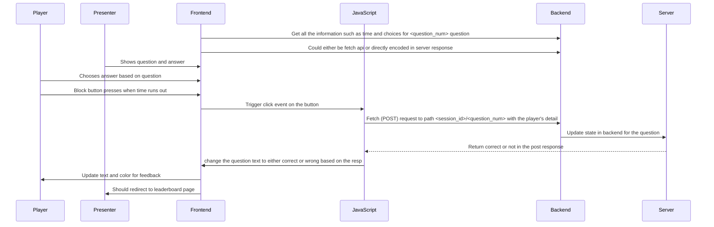

I have constructed this diagram as an overview of what the process may look like for the interaction between users, frontend and backend.

```mermaid
sequenceDiagram
    participant Player
    participant Presenter
    participant Frontend
    participant JavaScript
    participant Backend

    Frontend ->> Backend: Get all the information such as time and choices for <question_num> question
    Frontend ->> Backend: Could either be fetch api or directly encoded in server response

    Presenter ->> Frontend: Shows question and answer
    Player ->> Frontend: Chooses answer based on question
    Player ->> Frontend: Block button presses when time runs out
    Frontend ->> JavaScript: Trigger click event on the button
    JavaScript ->> Backend: Fetch (POST) request to path <session_id>/<question_num> with the player's detail
    Backend ->> Server: Update state in backend for the question
    Server -->> JavaScript: Return correct or not in the post response
    JavaScript ->> Frontend: change the question text to either correct or wrong based on the resp
    Frontend ->> Player: Update text and color for feedback
    Frontend ->> Presenter: Should redirect to leaderboard page

```